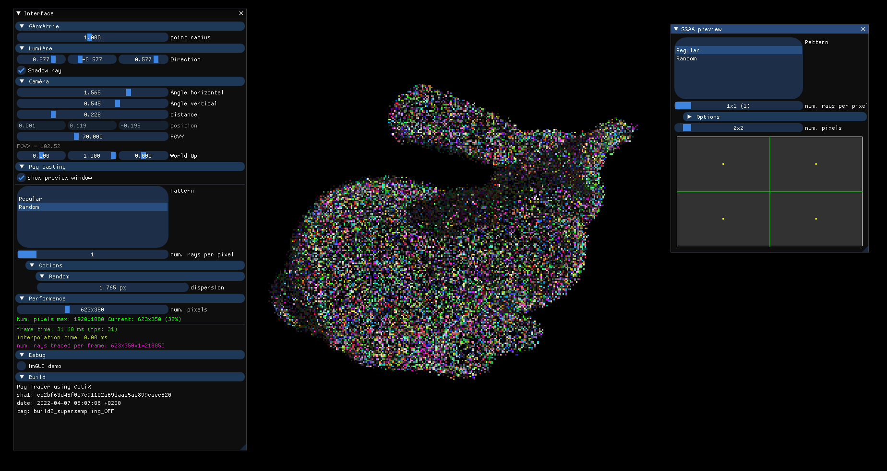
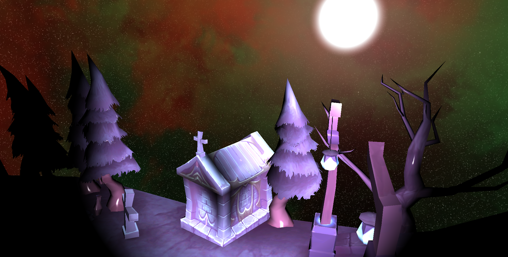
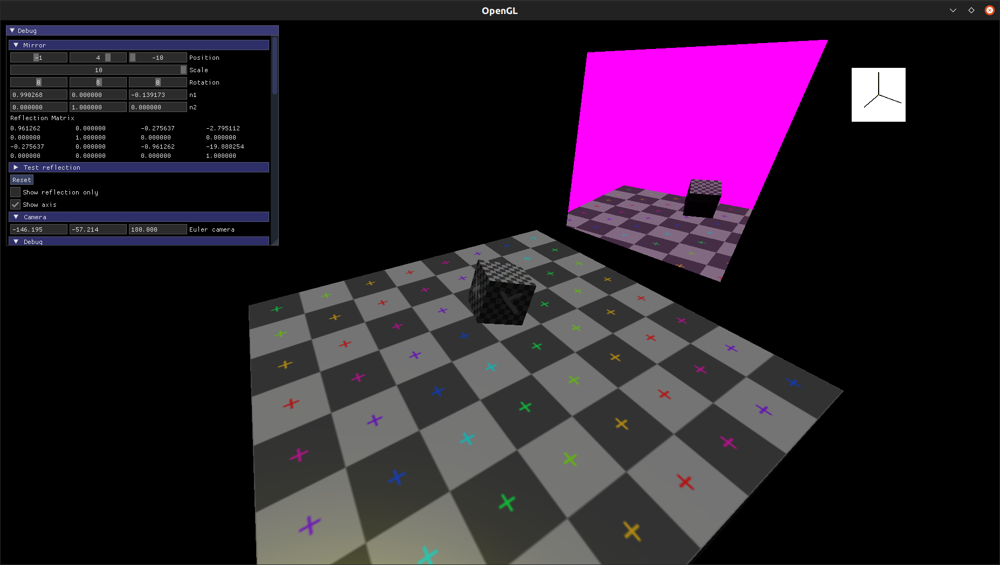
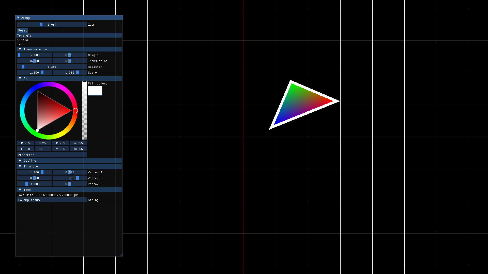

# Portfolio

## Smart video cropping

<video controls>
    <source src="assets/auto_cropping.mp4" type="video/mp4">
    Sorry, your browser doesn't support embedded videos.
</video>
- JIT compiled CUDA in Python

## Ray traced point cloud renderer

- OptiX and SSAA

## OpenGL

### Demo

- Lighting (Bloom, HDR, Spotlights, Skybox...)
- OBJ loading

### Mirror

- "Reflection matrix" by axis and normal

## Outline algorithm

## Deterministic Kinematic

<video controls>
    <source src="assets/rts_kinematic.mp4" type="video/mp4">
    Sorry, your browser doesn't support embedded videos.
</video>
- Implicit Euler; SAT theorem; Fixed-size partition; deterministic 16.16 fixed point; ECS
- Networked; Command-based server

## Space Invaders

<video controls>
    <source src="assets/space_invaders.mp4" type="video/mp4">
    Sorry, your browser doesn't support embedded videos.
</video>
- C++; Box2D; OpenGL; Low-level font rendering with Freetype

## Tilemap renderer

<video controls>
    <source src="assets/tilemap_renderer.mp4" type="video/mp4">
    Sorry, your browser doesn't support embedded videos.
</video>
- C++; SFML
